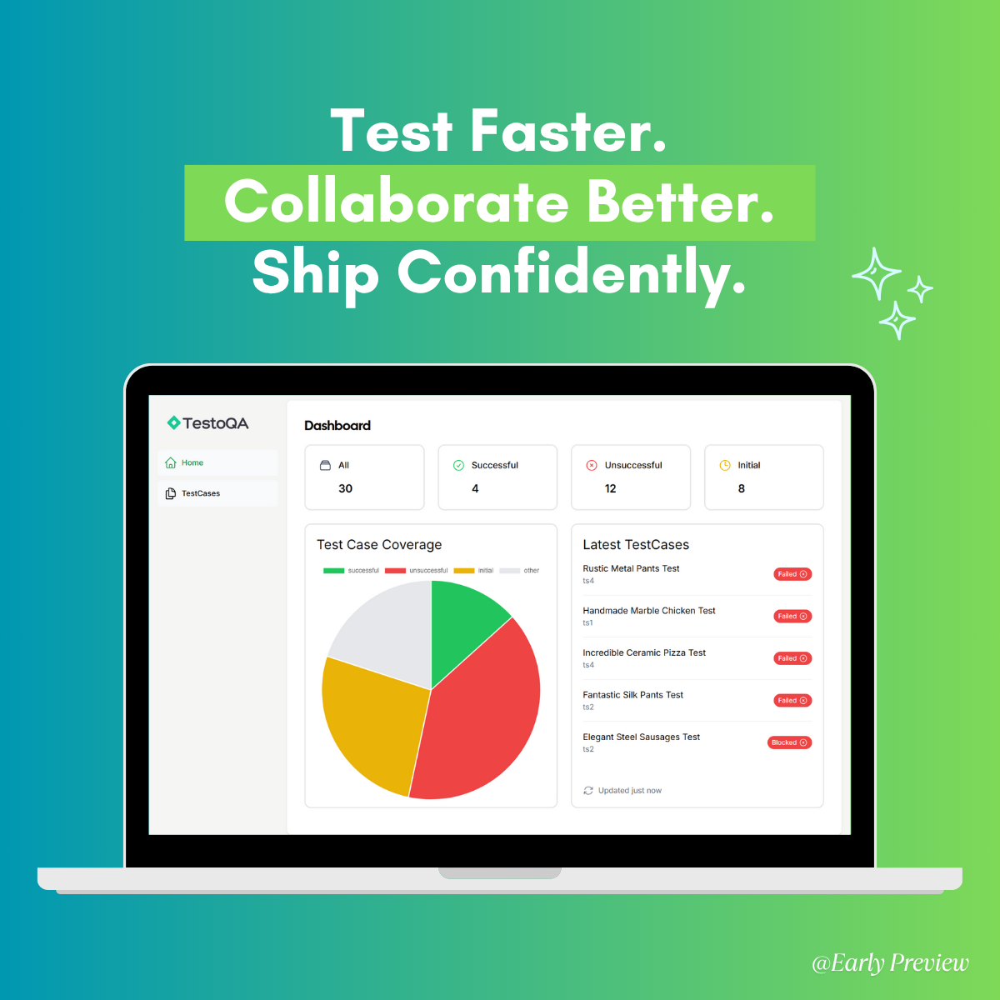

# 🚀 TestoQA

**Test Faster. Collaborate Better. Ship Confidently.**

**TestoQA** empowers QA and Dev teams to **collaborate, manage, and track software testing efforts**—so you can deliver
high-quality software, faster.

---

## 📸 Screenshot



---

## ✅ Prerequisites

* **Node.js** `v18` or higher
* **PostgreSQL** `v15` or higher
* **Docker** (optional, for Docker-based setup)

---

## 🛠️ Local Installation Guide

Follow these steps to get TestoQA running locally:

### 1️⃣ Clone the Repository

```bash
git clone https://github.com/rezwanul7/TestoQA.git
cd TestoQA
```

### 2️⃣ Configure Environment Variables

Copy the example environment file and update the values as needed:

```bash
cp .env.example .env
```

> 💡 Generate a secure `AUTH_SECRET` using:
>
> * macOS/Linux: `openssl rand -base64 32`
> * Windows: Use [this generator](https://generate-secret.vercel.app/32)

### 3️⃣ Install Dependencies

```bash
npm install
```

### 4️⃣ Setup Prisma Client & Apply Migrations

```bash
npx prisma generate
npx prisma migrate deploy
```

> ✅ This will apply existing migrations to your PostgreSQL database.

### 5️⃣ Start the Application

```bash
PORT=3000 HOSTNAME=0.0.0.0 node server.js
```

---

## 🔐 Demo Credentials

Use the following credentials to explore a demo workspace:

* **Email:** `testoqa@teamtesto.com`
* **Password:** `teamtesto`

---

## 🌱 Seed Sample Test Cases

To populate the app with sample test cases, visit:

```
http://localhost:3000/seed/test-cases/
```

---

## 🐳 Docker-Based Setup

TestoQA includes a Docker-based setup for easy deployment.

> **Requirements:**
>
> * Docker
> * Docker Compose

> ⚠️ On the first run, the application may take a few minutes to start as it applies database migrations and initializes
> services.

### 1️⃣ Prepare Environment Variables

Ensure your `.env` file is configured as described above.

### 2️⃣ Start the Application

```bash
docker compose up
```

---